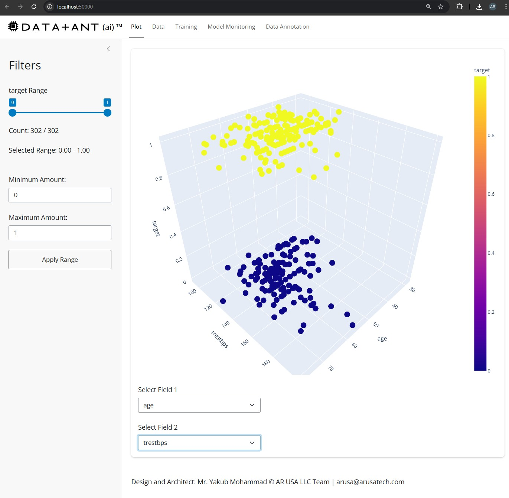
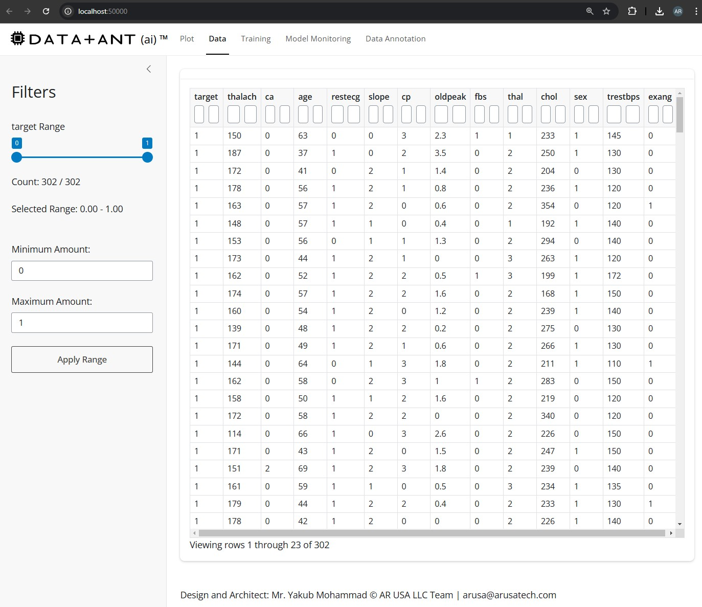
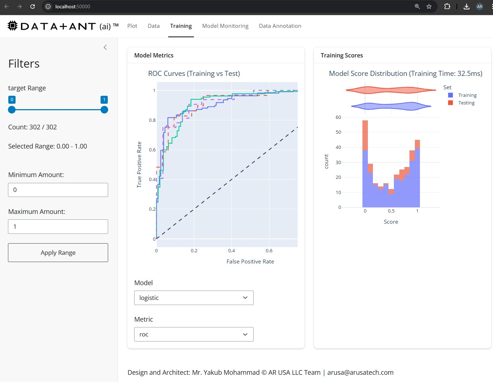
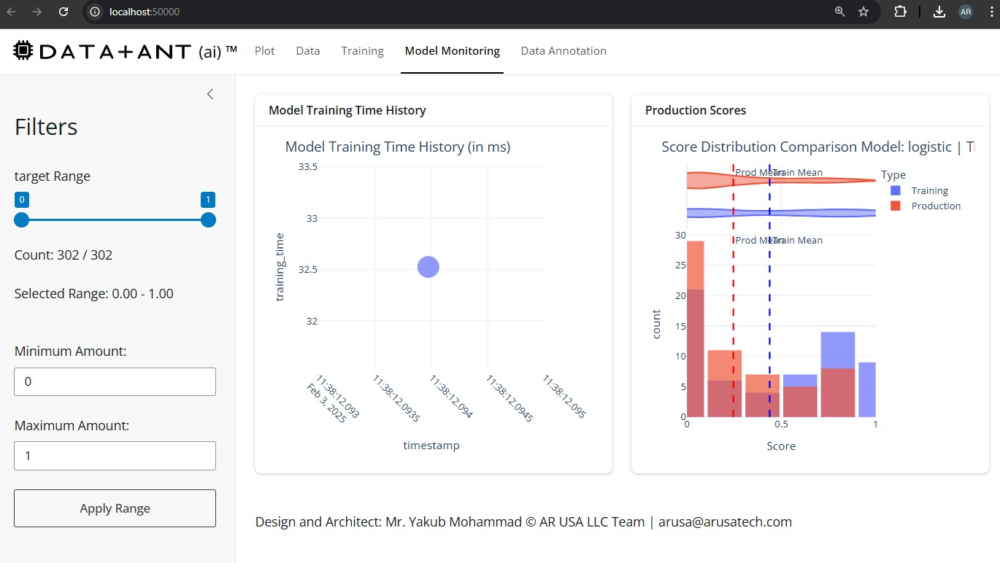
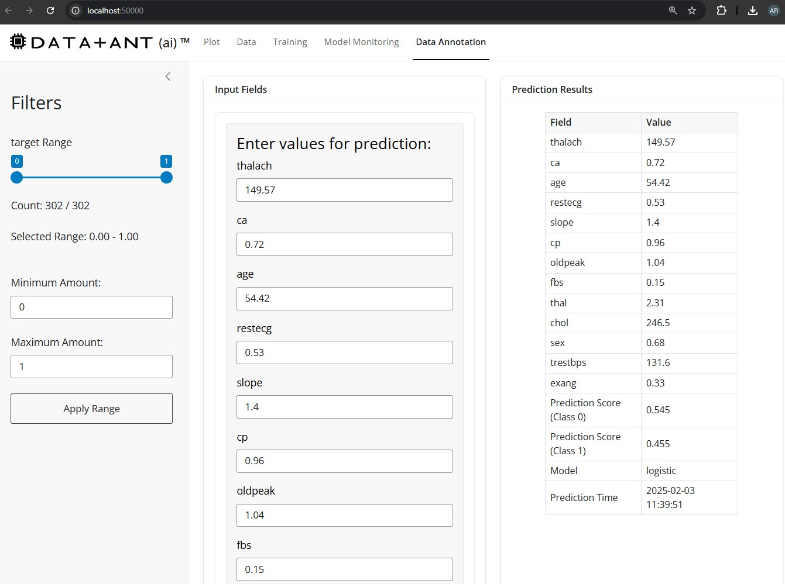

# DataAnt - AI-Powered Data Analysis Tool

DataAnt is an intelligent data analysis tool that combines machine learning with interactive visualization to help analyze and understand your data. It features a web-based UI built with Shiny for Python and integrates with Google's Gemini AI for natural language processing.

## Summary

- 🤖 AI-powered data analysis using Google's Gemini API
- 📊 Interactive data visualization with Plotly
- 🔍 Advanced machine learning models including:
  - Classification (Logistic Regression, SVM, Random Forest, XGBoost)
  - Regression (Linear, Ridge, Lasso)
  - Clustering (KMeans, DBSCAN)
- 📈 Real-time model monitoring and performance metrics
- 🔐 Secure credential management with encryption
- 🎯 Automated data cleaning and preprocessing

## Installation

1. Clone the repository:
```bash
git clone https://github.com/arusatech/dataant.git
cd dataant
```

2. Install required packages:
```bash
poetry install
or
poetry export -f requirements.txt --output requirements.txt --without-hashes
pip install -r requirements.txt
```

3. Create a config.json file in the root directory:
```json
{
    "db_file": "path/to/your/data.csv",
    "api_key": "your-google-api-key"
}
```

## Usage

1. Start the application:
```bash
python main.py -p "your analysis prompt"
```

Or use a prompt file:
```bash
python main.py -f prompt_file.txt
```

2. Command line options:
```bash
-p, --prompt     Provide analysis prompt directly
-f, --file       Provide prompt from a file
-d, --debug      Enable debug logging
-t, --template   Generate a prompt template file

Example:
(.vdataant) PS C:\dataant> python .\main.py --help                                        
usage: dataant [-h] [-p [PROMPT] | -f [FILE]] [-d] [-t]

options:
  -h, --help            show this help message and exit
  -p [PROMPT], --prompt [PROMPT]
                        Prompt: Generative Prompt for the Date Analytic bot
  -f [FILE], --file [FILE]
                        Prompt: provided as a file (use -t to get the prompt template)
  -d, --debug           Debug: Captures debug to the default temp file
  -t, --template        template: Generative Prompt template file
```

3. Setting up credentials:
```bash
python main.py -p "set api_key YOUR_GOOGLE_API_KEY"
python main.py -p "set db_file PATH_TO_YOUR_DATABASE"
```

## Example Prompts

1. Basic data analysis (heart disease dataset: db_file = "heart.csv" defined in config.json):
```
analyze the heart disease dataset focusing on age and cholesterol
```

2. List available fields:
```
list all fields in the dataset
```

3. Specific analysis:
```
analyze heart disease prediction using age, sex, and bp as features
```

## Project Structure

- `dataant/`
  - `model.py` - Machine learning model implementations
  - `ui_app.py` - Shiny web interface
  - `ui_plot.py` - Plotting functions
  - `util.py` - Utility functions
  - `engine.py` - Core analysis engine
  - `db.py` - Database operations
- `main.py` - Application entry point
- `config.json` - Configuration file

## Security

- API keys and sensitive data are encrypted using PBKDF2 with SHA256
- Credentials are stored securely in config.json
- User-specific encryption using system username and platform

## Requirements

- Python 3.8+
- Pandas
- Scikit-learn
- Plotly
- Shiny for Python
- Google Generative AI
- Cryptography

## Contributing

1. Fork the repository
2. Create your feature branch (`git checkout -b feature/amazing-feature`)
3. Commit your changes (`git commit -m 'Add amazing feature'`)
4. Push to the branch (`git push origin feature/amazing-feature`)
5. Open a Pull Request

## Features

### 1. Data Analysis
- Interactive data filtering and visualization
- Support for numeric and categorical features
- Dynamic range sliders for numeric fields
- Automatic handling of missing values
- Real-time data updates




### 2. Model Training
- Automated model training with LogisticRegression
- Feature selection and preprocessing
- Training/test split visualization
- Performance metrics calculation
- Model caching for improved performance



### 3. Model Monitoring
- Real-time training time tracking
- Score distribution visualization
- ROC and Precision-Recall curves
- Performance metrics tracking
- Error monitoring and logging



### 4. Data Annotation
- Interactive form for feature input
- Real-time predictions
- Support for both numeric and categorical inputs
- Clear visualization of prediction results
- User-friendly interface



### 5. Database Integration
- Support for multiple database types (dynamoDB, PostgreSQL, MySQL, etc.)
  - Note : corresponding db_file should be defined in config.json along with its credentials
- Real-time data synchronization
- Automated schema detection
- Connection pooling
- Query optimization

## License

This project is licensed under the MIT License - see the LICENSE file for details.

## Acknowledgments

- Design and Architecture: Mr. Yakub Mohammad
- © AR USA LLC Team
- Contact: arusa@arusatech.com

## Support

For support, please contact arusa@arusatech.com or open an issue in the repository.


